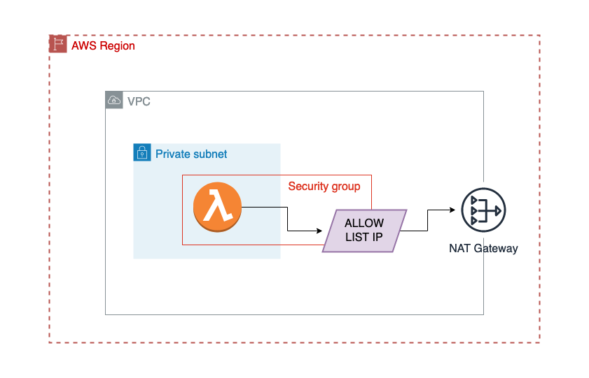

# AWS Lambda in Private Subnet with restrict outbound connection based on IP Allowlist

CDK example of:

- AWS Lambda running inside a VPC
- Restrict outbound connection based on IP Allowlist
- Custom Security Group in AWS Lambda to restrict outbound connection
- NAT Gateway in Public Subnet to allow Internet connection for AWS Lambda

Final architecture:

